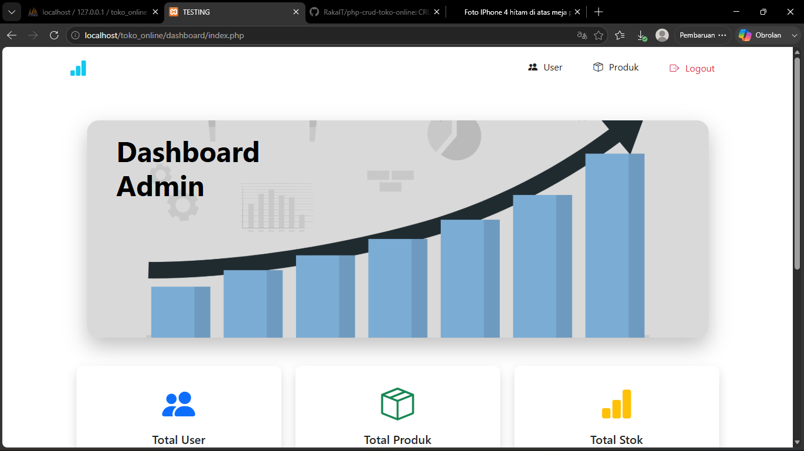
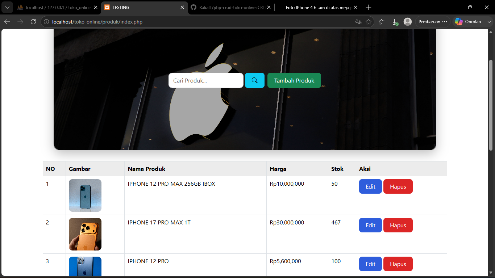
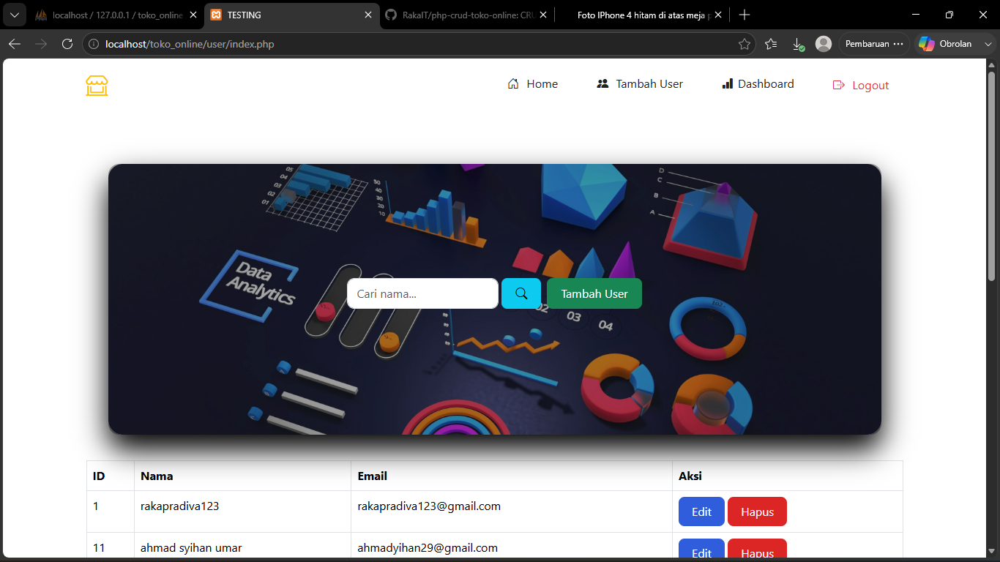

# 🛒 Aplikasi Toko Online

Aplikasi web sederhana berbasis **PHP Native**, **Bootstrap**, dan **MySQL** yang dibuat untuk belajar konsep CRUD, upload file, session login, dan dashboard admin.

---

## ✨ Fitur

- 🔐 Login & Logout Admin
- 📊 Dashboard Admin
- 👤 CRUD User
- 📦 CRUD Produk
- 🖼️ Upload Gambar Produk
- ✏️ Edit Produk & Gambar
- 🗑️ Hapus Produk Beserta Gambar
- 📈 Statistik Dashboard
- 🔍 Pencarian Produk

---

## 🛠️ Teknologi

- PHP 7.4
- Bootstrap 5
- MySQL
- XAMPP
- Git
- GitHub

---

## 📁 Struktur Project

```text
toko_online/
│
├── assets/
│   └── upload/
│
├── dashboard/
├── layout/
├── produk/
├── user/
│
├── koneksi.php
├── login.php
├── logout.php
└── README.md
```

---

## 🚀 Cara Menjalankan

1. Clone repository

```bash
git clone https://github.com/NAMA_USERNAME/NAMA_REPOSITORY.git
```

2. Pindahkan project ke folder:

```text
C:\xampp\htdocs\
```

3. Jalankan **Apache** dan **MySQL** melalui XAMPP.

4. Import database **toko_online.sql** ke phpMyAdmin.

5. Buka browser.

```text
http://localhost/toko_online
```

---

## 📸 Screenshot

### Dashboard

  

### Produk



### User



---

## 👨‍💻 Dibuat Oleh

**Raka Pradiva**

Project ini dibuat sebagai latihan belajar **PHP Native**, **Bootstrap**, **MySQL**, serta penggunaan **Git & GitHub**.